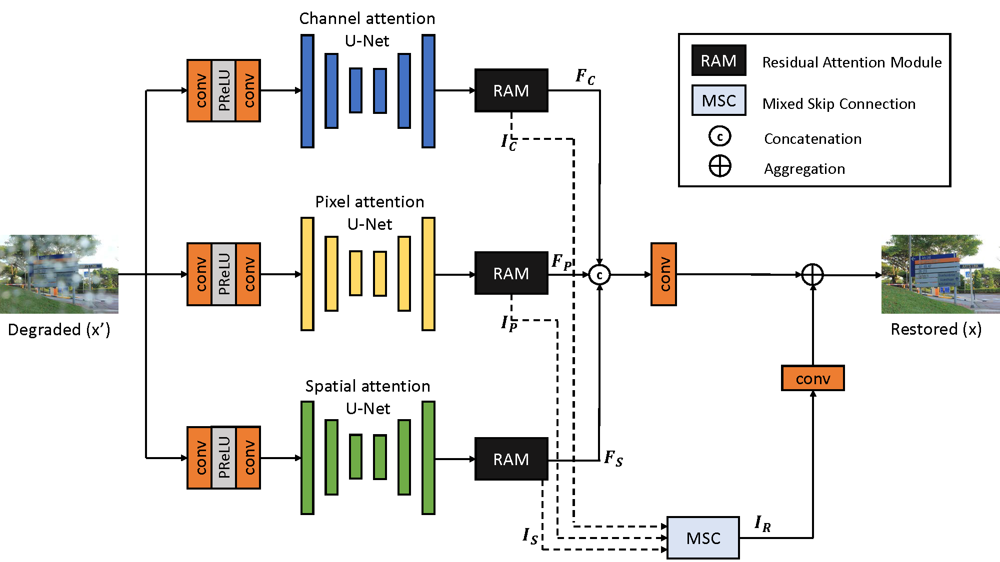
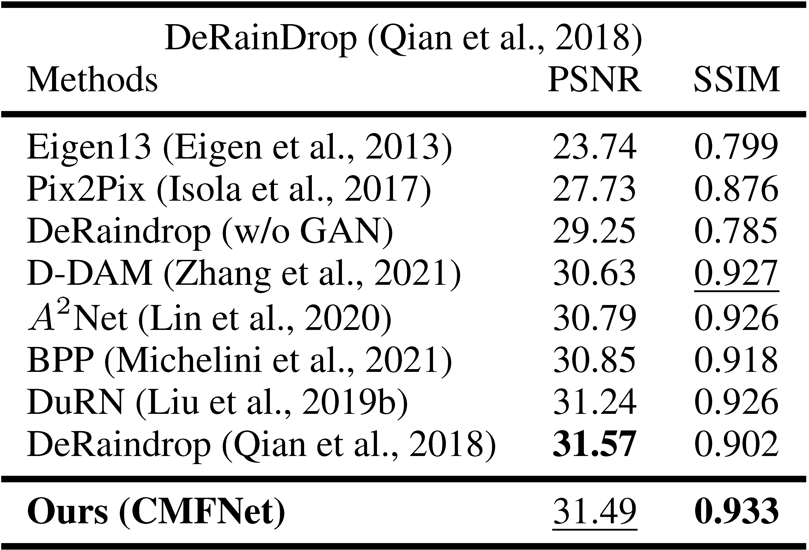
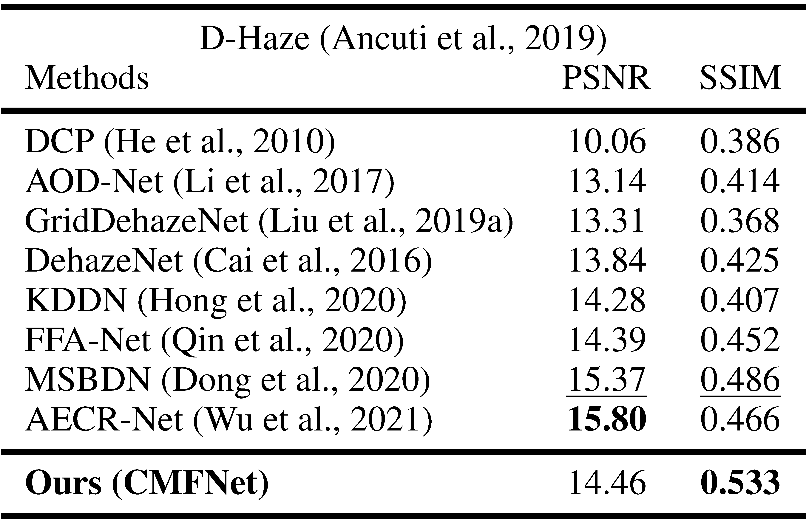
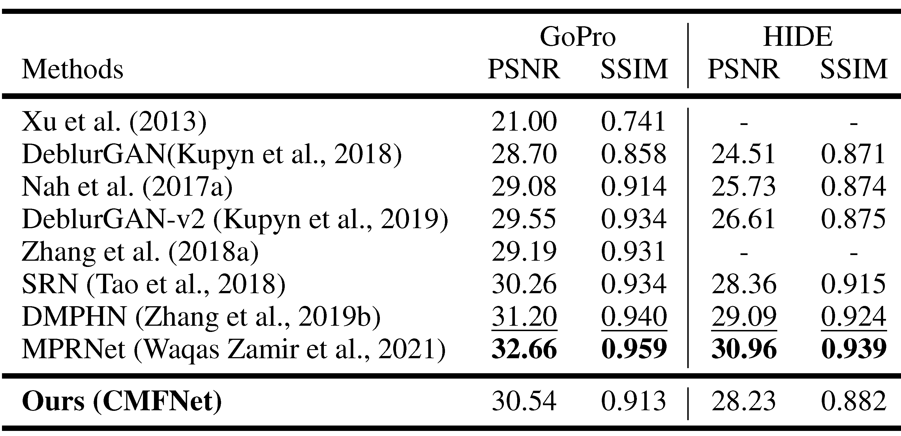
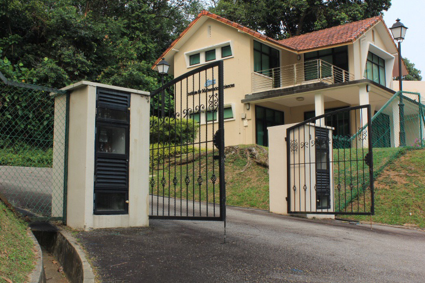
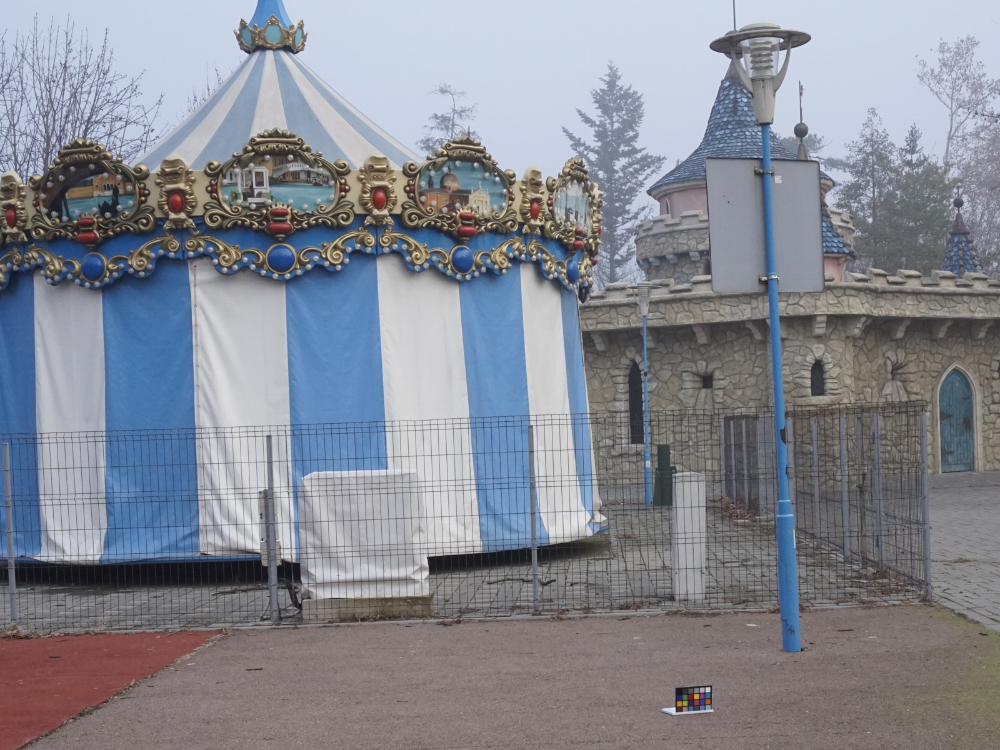

# Compound Multi-branch Feature Fusion for Real Image Restoration (ICLR 2022)  
## [Chi-Mao Fan](https://github.com/FanChiMao), Tsung-Jung Liu, Kuan-Hsien Liu  

Paper:  

Video Presentation:  

Presentation Slides:  

***
> Abstract : Image restoration is a challenging and ill-posed problem which also has been a long-standing issue. However, most of learning based restoration methods are proposed to target one degradation type which means they are lack of generalization. In this paper, we proposed a multi-branch restoration model inspired from the Human Visual System (i.e., Retinal Ganglion Cells) which can achieve multiple restoration tasks in a general framework. The experiments show that the proposed multi-branch architecture, called CMFNet, has competitive performance results on four datasets, including image deblurring, dehazing and deraindrop which are very common applications for autonomous cars.

## Network Architecture  
  

## Quick Run  
To test the pre-trained models of Deraindrop, Dehaze, Deblurring on your own images, run
```
python demo.py --input_dir images_folder_path --result_dir save_images_here --weights path_to_models
```
Here is an example to perform Deraindrop:
```
python demo.py --input_dir ./demo_samples/deraindrop --result_dir ./demo_results --weights ./pretrained_model/deraindrop_model.pth
```

## Results
<details>  
<summary>Result Tables: </summary>  

- Deraindrop  
  

- Dehaze  
  

- Deblur  
  

</details>  

## Visual Comparison  
<details>  
<summary>Visual Comparison Figures: </summary>  
  
  | Restoration task |    Restored images   |  Ground Truth     |
  | :--------------: | :------------------: | :---------------: |
  | Deraindrop       |||
  | Dehaze           |||  
  | Dehaze           |||
  
</details>  

## Citation  

## Contact
If you have any question, please contact qaz5517359@gmail.com  
